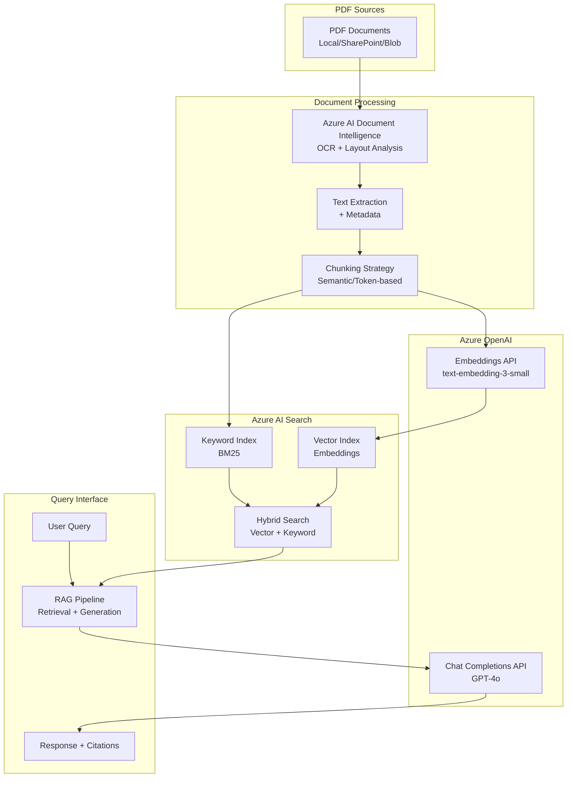

Key Features
- 1 Azure AI Document Intelligence
OCR + Layout Analysis: Extracts text from scanned PDFs and preserves document structure
Table Extraction: Identifies and extracts tabular data
Markdown Output: Returns content in markdown format for better chunking
- 2 Hybrid Search (Vector + BM25)
Vector Search: Semantic similarity using Azure OpenAI embeddings
Keyword Search: BM25 for exact term matching
Combined: Best of both worlds for accurate retrieval
- 3 Token-Based Chunking
Uses tiktoken for accurate token counting (500-1000 tokens per chunk)
Semantic separators (paragraphs, sentences) for better context preservation
Overlap to maintain continuity between chunks
- 4 RAG with Citations Retrieves top-K relevant chunks
Numbers each chunk as [1], [2], etc.
LLM instructed to cite sources in response
-----

---
env
---
```python
# Azure AI Document Intelligence
AZURE_DOC_INTELLIGENCE_ENDPOINT="https://your-doc-intelligence.cognitiveservices.azure.com/"
AZURE_DOC_INTELLIGENCE_KEY="your-key"

# Azure OpenAI
AZURE_OPENAI_API_KEY="your-openai-key"
AZURE_OPENAI_ENDPOINT="https://your-resource.openai.azure.com/"
AZURE_OPENAI_API_VERSION="2024-02-15-preview"
AZURE_OPENAI_CHAT_DEPLOYMENT="gpt-4o"
AZURE_OPENAI_EMBEDDINGS_DEPLOYMENT="text-embedding-3-small"

# Azure AI Search
AZURE_SEARCH_SERVICE_ENDPOINT="https://your-search.search.windows.net"
AZURE_SEARCH_ADMIN_KEY="your-search-key"
AZURE_SEARCH_INDEX_NAME="pdf-knowledge-base"
```python
---
complete processing pipeline
----
```python
import os
import io
from typing import List, Dict
from dotenv import load_dotenv
from azure.ai.documentintelligence import DocumentIntelligenceClient
from azure.core.credentials import AzureKeyCredential
from azure.ai.documentintelligence.models import AnalyzeResult, ContentFormat
from langchain_openai import AzureOpenAIEmbeddings, AzureChatOpenAI
from langchain_community.vectorstores.azuresearch import AzureSearch
from langchain.schema import Document
from langchain_text_splitters import RecursiveCharacterTextSplitter
import tiktoken

load_dotenv()


class PDFProcessingPipeline:
    """Complete PDF processing pipeline with Azure AI integration."""
    
    def __init__(self):
        # Initialize Azure AI Document Intelligence
        self.doc_intelligence = DocumentIntelligenceClient(
            endpoint=os.getenv("AZURE_DOC_INTELLIGENCE_ENDPOINT"),
            credential=AzureKeyCredential(os.getenv("AZURE_DOC_INTELLIGENCE_KEY"))
        )
        
        # Initialize Azure OpenAI Embeddings
        self.embeddings = AzureOpenAIEmbeddings(
            azure_deployment=os.getenv("AZURE_OPENAI_EMBEDDINGS_DEPLOYMENT"),
            openai_api_version=os.getenv("AZURE_OPENAI_API_VERSION"),
            azure_endpoint=os.getenv("AZURE_OPENAI_ENDPOINT"),
            api_key=os.getenv("AZURE_OPENAI_API_KEY"),
        )
        
        # Initialize Azure AI Search Vector Store
        self.vector_store = AzureSearch(
            azure_search_endpoint=os.getenv("AZURE_SEARCH_SERVICE_ENDPOINT"),
            azure_search_key=os.getenv("AZURE_SEARCH_ADMIN_KEY"),
            index_name=os.getenv("AZURE_SEARCH_INDEX_NAME"),
            embedding_function=self.embeddings.embed_query,
        )
        
        # Initialize LLM for RAG
        self.llm = AzureChatOpenAI(
            azure_deployment=os.getenv("AZURE_OPENAI_CHAT_DEPLOYMENT"),
            openai_api_version=os.getenv("AZURE_OPENAI_API_VERSION"),
            azure_endpoint=os.getenv("AZURE_OPENAI_ENDPOINT"),
            api_key=os.getenv("AZURE_OPENAI_API_KEY"),
            temperature=0.2,
        )
    
    # ==========================================
    # STEP 1: PDF EXTRACTION (Azure AI Document Intelligence)
    # ==========================================
    def extract_pdf_content(self, pdf_path: str) -> Dict:
        """
        Extract text, tables, and structure from PDF using Azure AI Document Intelligence.
        Returns structured content with metadata.
        """
        print(f"[1/4] Extracting content from {pdf_path}...")
        
        with open(pdf_path, "rb") as pdf_file:
            poller = self.doc_intelligence.begin_analyze_document(
                "prebuilt-layout",  # Use "prebuilt-read" for text-only
                pdf_file,
                output_content_format=ContentFormat.MARKDOWN  # Get markdown format
            )
            result: AnalyzeResult = poller.result()
        
        # Extract structured content
        extracted_data = {
            "content": result.content,  # Full markdown content
            "tables": [],
            "metadata": {
                "page_count": len(result.pages),
                "language": result.content_locale if hasattr(result, 'content_locale') else "unknown",
            }
        }
        
        # Extract tables if present
        if result.tables:
            for table in result.tables:
                extracted_data["tables"].append({
                    "row_count": table.row_count,
                    "column_count": table.column_count,
                    "cells": table.cells
                })
        
        print(f"     -> Extracted {extracted_data['metadata']['page_count']} pages")
        return extracted_data
    
    # ==========================================
    # STEP 2: CHUNKING (Semantic/Token-based)
    # ==========================================
    def chunk_content(self, content: str, chunk_size: int = 800, overlap: int = 100) -> List[Document]:
        """
        Split extracted content into semantic chunks using token-based splitting.
        """
        print(f"[2/4] Chunking content (size: {chunk_size} tokens, overlap: {overlap})...")
        
        # Use tiktoken for accurate token counting
        text_splitter = RecursiveCharacterTextSplitter.from_tiktoken_encoder(
            model_name="gpt-4o",
            chunk_size=chunk_size,
            chunk_overlap=overlap,
            separators=["\n\n", "\n", ". ", " ", ""]  # Prioritize paragraph breaks
        )
        
        chunks = text_splitter.split_text(content)
        
        # Convert to LangChain Documents with metadata
        documents = [
            Document(
                page_content=chunk,
                metadata={
                    "chunk_id": i,
                    "total_chunks": len(chunks),
                    "source": "pdf_document"
                }
            )
            for i, chunk in enumerate(chunks)
        ]
        
        print(f"     -> Created {len(documents)} chunks")
        return documents
    
    # ==========================================
    # STEP 3: EMBEDDING & INDEXING (Azure OpenAI + AI Search)
    # ==========================================
    def index_documents(self, documents: List[Document]):
        """
        Generate embeddings and store in Azure AI Search with hybrid search capability.
        """
        print(f"[3/4] Generating embeddings and indexing to Azure AI Search...")
        
        # AzureSearch automatically:
        # 1. Calls Azure OpenAI to generate embeddings
        # 2. Creates/updates the search index schema
        # 3. Uploads documents with vectors
        self.vector_store.add_documents(documents=documents)
        
        print(f"     -> Successfully indexed {len(documents)} documents")
    
    # ==========================================
    # STEP 4: RAG QUERY (Hybrid Search + Generation)
    # ==========================================
    def query(self, question: str, top_k: int = 5) -> str:
        """
        Perform hybrid search (vector + keyword) and generate answer with citations.
        """
        print(f"[4/4] Querying: '{question}'")
        
        # Create hybrid retriever (Vector + BM25)
        retriever = self.vector_store.as_retriever(
            search_type="hybrid",
            search_kwargs={"k": top_k}
        )
        
        # Retrieve relevant chunks
        docs = retriever.invoke(question)
        
        # Format context with citations
        context = "\n\n---\n\n".join([
            f"[{i+1}] {doc.page_content}" for i, doc in enumerate(docs)
        ])
        
        # Generate answer using LLM
        from langchain_core.prompts import ChatPromptTemplate
        from langchain_core.output_parsers import StrOutputParser
        
        prompt = ChatPromptTemplate.from_template("""
You are a helpful assistant. Answer the question using ONLY the provided context.
Cite sources using [1], [2], etc.

CONTEXT:
{context}

QUESTION: {question}

ANSWER:""")
        
        chain = prompt | self.llm | StrOutputParser()
        answer = chain.invoke({"context": context, "question": question})
        
        return answer
    
    # ==========================================
    # FULL PIPELINE EXECUTION
    # ==========================================
    def process_pdf(self, pdf_path: str):
        """Run the complete PDF processing pipeline."""
        print(f"\n{'='*60}")
        print(f"Processing: {pdf_path}")
        print(f"{'='*60}\n")
        
        # Step 1: Extract
        extracted = self.extract_pdf_content(pdf_path)
        
        # Step 2: Chunk
        documents = self.chunk_content(extracted["content"])
        
        # Step 3: Index
        self.index_documents(documents)
        
        print(f"\n✅ PDF processing complete! Ready for queries.\n")


# ==========================================
# USAGE EXAMPLE
# ==========================================
if __name__ == "__main__":
    # Initialize pipeline
    pipeline = PDFProcessingPipeline()
    
    # Process a PDF document
    pdf_file = "sample_document.pdf"  # Replace with your PDF path
    pipeline.process_pdf(pdf_file)
    
    # Query the indexed documents
    question = "What is the main topic of this document?"
    answer = pipeline.query(question)
    
    print(f"\n❓ Question: {question}")
    print(f"💡 Answer: {answer}")

```python

---
---

```mermaid

```
---


Production Deployment Checklist
- ✅ Scalability
Use Azure Functions for auto-scaling
Implement queue-based processing (Azure Service Bus)
Batch processing for large volumes
- ✅ Reliability
Retry logic with exponential backoff
Dead-letter queue for failed processing
Health checks and monitoring
- ✅ Security
Azure Key Vault for secrets
Managed identities for service-to-service auth
Content Safety filtering (pre/post)
- ✅ Monitoring
Azure Application Insights for tracing
Log Analytics for audit trails
Custom metrics (processing time, accuracy)
- ✅ Cost Optimization
Use appropriate SKUs (standard vs premium)
Implement caching for frequent queries
Archive old documents to cold storage
This architecture provides a complete, production-ready Gen AI PDF processing pipeline with OCR, intelligent extraction, and RAG-based querying.

```mermaid
graph TB
    subgraph "📥 Ingestion Layer"
        A1[SharePoint]
        A2[Azure Blob Storage]
        A3[Email Attachments]
        A4[Web Upload]
        A5[FTP/SFTP]
    end
    
    subgraph "🔄 Orchestration Layer"
        B1[Azure Data Factory<br/>Pipeline Orchestration]
        B2[Azure Functions<br/>Event-Driven Triggers]
        B3[Logic Apps<br/>Workflow Automation]
    end
    
    subgraph "📄 PDF Pre-Processing"
        C1[PDF Validation<br/>Format Check]
        C2[Image Enhancement<br/>Deskew/Denoise]
        C3[Page Segmentation<br/>Multi-page Split]
        C4[Password Removal<br/>Decryption]
    end
    
    subgraph "🔍 OCR & Document Intelligence"
        D1[Azure AI Document Intelligence<br/>Layout Analysis]
        D2[OCR Engine<br/>Text Recognition]
        D3[Table Extraction<br/>Structure Detection]
        D4[Figure/Chart Detection<br/>Image Analysis]
        D5[Handwriting Recognition<br/>ICR]
    end
    
    subgraph "🧹 Post-Processing & Validation"
        E1[Text Normalization<br/>Unicode Cleanup]
        E2[Language Detection<br/>Multi-language Support]
        E3[Confidence Scoring<br/>Quality Metrics]
        E4[Human-in-the-Loop<br/>Validation Queue]
        E5[Metadata Extraction<br/>Author/Date/Tags]
    end
    
    subgraph "🧠 Gen AI Processing"
        F1[Semantic Chunking<br/>500-1000 tokens]
        F2[Embedding Generation<br/>Azure OpenAI]
        F3[Summarization<br/>GPT-4o]
        F4[Entity Extraction<br/>NER]
        F5[Classification<br/>Document Type]
    end
    
    subgraph "💾 Storage Layer"
        G1[Azure AI Search<br/>Vector + Keyword Index]
        G2[Cosmos DB<br/>Document Metadata]
        G3[Blob Storage<br/>Original PDFs]
        G4[SQL Database<br/>Audit Logs]
        G5[Redis Cache<br/>Frequent Queries]
    end
    
    subgraph "🔎 Query & Retrieval"
        H1[Hybrid Search<br/>Vector + BM25]
        H2[RAG Pipeline<br/>Context Assembly]
        H3[Content Safety<br/>Pre/Post Filtering]
        H4[Response Generation<br/>GPT-4o]
    end
    
    subgraph "📤 Output & Integration"
        I1[REST API<br/>FastAPI/Flask]
        I2[Web UI<br/>React/Angular]
        I3[Power BI<br/>Analytics Dashboard]
        I4[Microsoft Teams<br/>Bot Integration]
        I5[Export Formats<br/>JSON/CSV/Markdown]
    end
    
    A1 --> B1
    A2 --> B2
    A3 --> B3
    A4 --> B2
    A5 --> B1
    
    B1 --> C1
    B2 --> C1
    B3 --> C1
    
    C1 --> C2
    C2 --> C3
    C3 --> C4
    
    C4 --> D1
    D1 --> D2
    D1 --> D3
    D1 --> D4
    D1 --> D5
    
    D2 --> E1
    D3 --> E1
    D4 --> E1
    D5 --> E1
    
    E1 --> E2
    E2 --> E3
    E3 --> E4
    E4 --> E5
    
    E5 --> F1
    F1 --> F2
    F1 --> F3
    F1 --> F4
    F1 --> F5
    
    F2 --> G1
    F3 --> G2
    F4 --> G2
    F5 --> G2
    C1 --> G3
    E3 --> G4
    
    G1 --> H1
    H1 --> H2
    H2 --> H3
    H3 --> H4
    
    H4 --> I1
    H4 --> I2
    G2 --> I3
    H4 --> I4
    H4 --> I5
```mermaid
