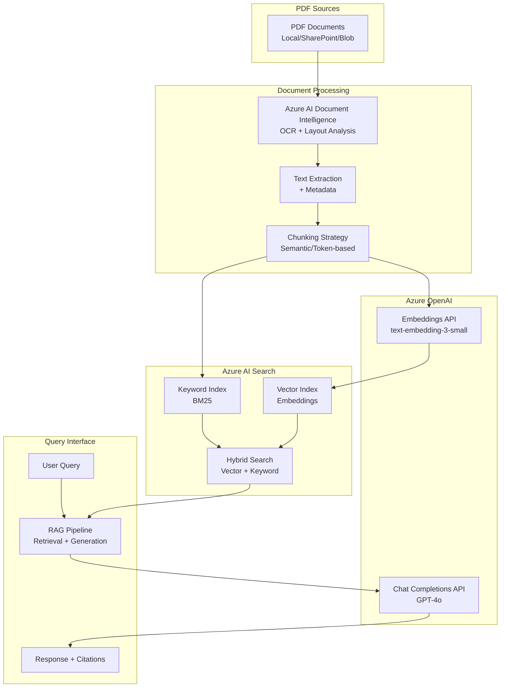

Key Features
- 1 Azure AI Document Intelligence
OCR + Layout Analysis: Extracts text from scanned PDFs and preserves document structure
Table Extraction: Identifies and extracts tabular data
Markdown Output: Returns content in markdown format for better chunking
- 2 Hybrid Search (Vector + BM25)
Vector Search: Semantic similarity using Azure OpenAI embeddings
Keyword Search: BM25 for exact term matching
Combined: Best of both worlds for accurate retrieval
- 3 Token-Based Chunking
Uses tiktoken for accurate token counting (500-1000 tokens per chunk)
Semantic separators (paragraphs, sentences) for better context preservation
Overlap to maintain continuity between chunks
- 4 RAG with Citations Retrieves top-K relevant chunks
Numbers each chunk as [1], [2], etc.
LLM instructed to cite sources in response
-----

